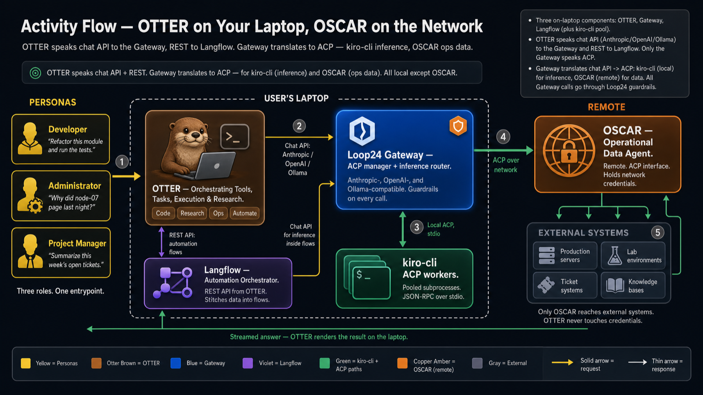
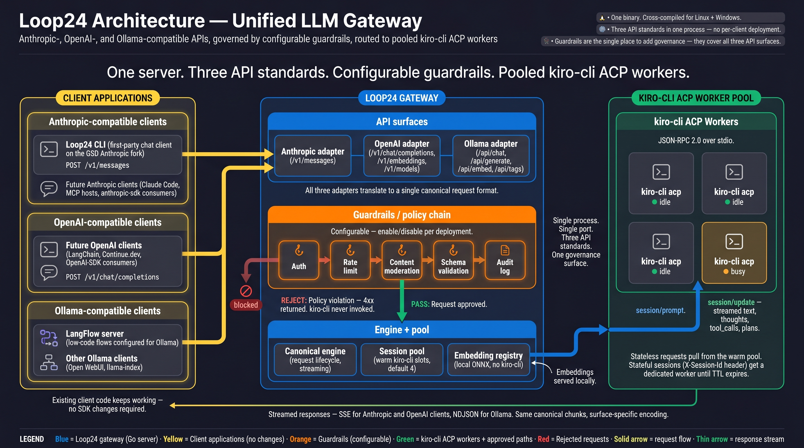

<!-- OTTO Gateway — the inference + ACP router at the heart of the OTTO stack -->

# OTTO Gateway

> The brain of the **OTTO** product family. One process, three API standards, a configurable guardrails chain, and pooled `kiro-cli` ACP workers.

The OTTO Gateway is the on-laptop component that every other piece of the OTTO stack talks to when it needs to think. OTTER (the CLI) sends chat-completion calls here. Langflow sends inference calls here. OSCAR's operational data round-trips through here. Whatever speaks Anthropic, OpenAI, or Ollama on one side gets translated into ACP — to local `kiro-cli` workers for inference or to remote OSCAR for ops data — on the other.

---

## Where the Gateway fits

Everything inside the dashed laptop boundary lives on the user's machine. Only OSCAR and the external systems behind it are remote.



The Gateway is the dark-blue tile at the center of the laptop. Its job in one sentence: **translate standard chat APIs and REST traffic into the right ACP call, apply guardrails on every request, stream the answer back.**

Concretely:

- **OTTER → Gateway** speaks Anthropic / OpenAI / Ollama chat-completion APIs. OTTER never speaks raw ACP — the Gateway does.
- **Langflow → Gateway** speaks the same chat APIs when a flow needs inference.
- **Gateway → kiro-cli pool** speaks ACP over stdio (JSON-RPC 2.0). The pool lives on the same laptop, managed by the Gateway as warm subprocesses.
- **Gateway → OSCAR** speaks ACP over the network. OSCAR holds the credentials for production servers, lab environments, ticket systems, and knowledge bases. The Gateway is the only component that crosses the laptop boundary in this stack.

The architectural value: every LLM token on the laptop egresses through one process. Auth, rate limiting, content moderation, schema validation, and audit logging all live in the Gateway's guardrails chain — configured once, applied to every surface.

---

## Inside the Gateway

The activity diagram above shows the Gateway as one tile. The architecture diagram below shows what is inside that tile.



Reading left-to-right:

1. **Client applications** (yellow) speak Anthropic-, OpenAI-, or Ollama-compatible APIs. OTTER, Langflow, and any drop-in client (Pi CLI, LangChain, Continue.dev, Open WebUI, llama-index) all land here without SDK changes.
2. **API surfaces** (blue) — three thin adapter blocks translate inbound requests into a single canonical request shape. The OpenAI adapter mounts `/v1/chat/completions`, `/v1/embeddings`, `/v1/models`. The Ollama adapter mounts `/api/chat`, `/api/generate`, `/api/embed`, `/api/tags`. The Anthropic adapter mounts `/v1/messages`.
3. **Guardrails / policy chain** (orange — visually elevated because this is the focal point) — a configurable hexagonal chain: Auth → Rate limit → Content moderation → Schema validation → Audit log. Enabled or disabled per deployment. Pass continues; reject returns a 4xx and `kiro-cli` is never invoked.
4. **Engine + pool** (blue) — the canonical engine drives the request lifecycle and streaming. The session pool holds warm `kiro-cli` slots (default 4). The embedding registry serves local ONNX embeddings without invoking `kiro-cli`.
5. **kiro-cli ACP worker pool** (green) — pooled subprocesses speaking JSON-RPC 2.0 over stdio. Stateless requests pull from the warm pool; stateful sessions (`X-Session-Id` header) get a dedicated worker until TTL expires.

The response path streams back to the original surface using the surface-appropriate encoding — SSE for OpenAI/Anthropic, NDJSON for Ollama. Same canonical chunks, surface-specific framing.

---

## Why this matters

**One binary. One port. Three API standards.** No per-client deployment, no per-surface guardrail config. Add a policy once; it covers Anthropic, OpenAI, and Ollama clients alike.

**Configurable governance.** The guardrails chain is the single place to enforce auth, rate limits, content moderation, schema validation, and audit. Each hook is opt-in per deployment. A compliance reviewer audits one chain, not N client integrations.

**Pooled `kiro-cli` workers.** Stateless requests pull from a warm pool. Stateful sessions stick to a dedicated worker until their TTL expires. Pool size, TTL, and ping interval are all configurable.

**Embeddings stay local.** The embedding registry uses local ONNX models. No `kiro-cli` invocation. Useful when an LLM call is not what the request actually needs.

**Cross-compiled.** One Go binary, built for Linux and Windows from the same source.

---

## Status

**Pre-implementation.** The scaffold and design docs are in place; phase planning happens via `/gsd:new-project` and the design docs in `docs/`.

The full design brief — clients, API surfaces, adapter pattern, guardrails plugin model, trust gates, milestone plan — lives in [`docs/briefs/go_port_brief.md`](docs/briefs/go_port_brief.md).

---

## Project layout

```
cmd/otto-gateway/   # binary entrypoint
internal/
  acp/                # ACPSession + JSON-RPC over stdio (kiro-cli)
  adapter/
    anthropic/        # Anthropic API surface (translates ↔ canonical)
    ollama/           # Ollama API surface (translates ↔ canonical)
    openai/           # OpenAI API surface (translates ↔ canonical)
  canonical/          # canonical request/response types
  config/             # env loading
  embed/              # local embeddings (ONNX)
  engine/             # consumes canonical, drives pool/registry/ACP
  plugin/             # PreHook/PostHook interface + chain
  pool/               # ACPPool + SessionRegistry
  server/             # HTTP router, middleware, surface mounting
  version/            # build-time version info
docs/                 # design docs, architecture, reference material
```

Layer invariants enforced by the trust-gate config (see brief §3.8):

- `internal/adapter/*` imports `internal/canonical` + `internal/plugin` only.
- `internal/engine` imports `internal/canonical/pool/acp/embed/plugin`.
- `internal/canonical` imports nothing else under `internal/`.

---

## Running

Build the binary first, then use the platform wrapper script:

**macOS / Linux:**

```bash
make build
./scripts/otto start    # launch in background
./scripts/otto status   # check PID + /health
./scripts/otto stop     # stop gracefully
```

**Windows (PowerShell):**

```powershell
make build
.\scripts\otto.ps1 start
.\scripts\otto.ps1 status
.\scripts\otto.ps1 stop
```

`make start`, `make status`, and `make stop` are Makefile shortcuts for the POSIX wrapper on macOS/Linux.

See [`docs/operating.md`](docs/operating.md) for full reference: PID and log file locations, env-var overrides (`OTTO_BIN`, `OTTO_PID`, `OTTO_LOG`, `OTTO_ADDR`), gateway env vars (`HTTP_ADDR`, `KIRO_CMD`, `PING_INTERVAL`, …), and how `status` works.

---

## Development

```bash
make help          # show all targets
make run           # run the gateway locally
make build         # build for host platform
make test          # run tests
make test-race     # tests with race detector (CI default)
make lint          # golangci-lint
make fmt           # format
make cross         # cross-compile Linux + Windows binaries
```

### Prerequisites

- Go 1.23+
- `golangci-lint` 1.62+ (optional locally; required in CI)
- `gofumpt` (optional; `make fmt` falls back to `gofmt`)
- `pre-commit` (optional; `pre-commit install` to enable hooks)

---

## Where to learn more about the rest of the OTTO stack

- **OTTER** (the CLI client) — see the loop24-client repo. OTTER (call it OTTO for short) is the on-laptop entrypoint that drives the Gateway.
- **Langflow** — the low-code automation orchestrator. OTTER calls it via REST; flows inside Langflow call back into the Gateway for any inference they need.
- **OSCAR** — the remote operations agent. Exposes an ACP interface that this Gateway is the only component allowed to talk to.

The activity-flow diagram at the top of this README is the canonical picture. The source prompts for both diagrams live in [`docs/architecture/otto_architecture_infographic_prompt.md`](docs/architecture/otto_architecture_infographic_prompt.md) (architecture) and in the loop24-client `docs/branding/` folder (activity flow).

---

## License

TBD.
