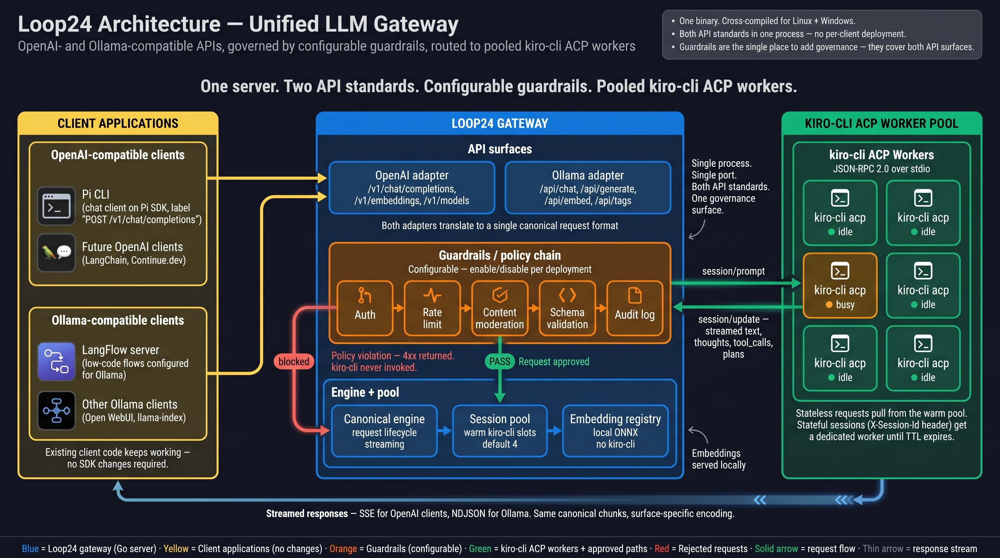

# Loop24 Gateway

A Go-based LLM gateway that proxies requests from OpenAI- and
Ollama-compatible clients to a pool of `kiro-cli` ACP worker
subprocesses, with a configurable guardrails chain in between.



## Status

**Pre-implementation.** The scaffold exists; phase planning happens via
`/gsd:new-project` and the design docs in `docs/`.

The full design brief — clients, API surfaces, adapter pattern,
guardrails plugin model, trust gates, milestone plan — lives in
[`docs/briefs/go_port_brief.md`](docs/briefs/go_port_brief.md).

## Project layout

```
cmd/loop24-gateway/   # binary entrypoint
internal/
  acp/                # ACPSession + JSON-RPC over stdio (kiro-cli)
  adapter/
    ollama/           # Ollama API surface (translates ↔ canonical)
    openai/           # OpenAI API surface (translates ↔ canonical)
  canonical/          # canonical request/response types
  config/             # env loading
  embed/              # local embeddings
  engine/             # consumes canonical, drives pool/registry/ACP
  plugin/             # PreHook/PostHook interface + chain
  pool/               # ACPPool + SessionRegistry
  server/             # HTTP router, middleware, surface mounting
  version/            # build-time version info
docs/                 # design docs, architecture, reference material
```

Layer invariants enforced by the trust-gate config (see brief §3.8):

- `internal/adapter/*` imports `internal/canonical` + `internal/plugin` only.
- `internal/engine` imports `internal/canonical/pool/acp/embed/plugin`.
- `internal/canonical` imports nothing else under `internal/`.

## Development

```bash
make help          # show all targets
make run           # run the gateway locally
make build         # build for host platform
make test          # run tests
make test-race     # tests with race detector (CI default)
make lint          # golangci-lint
make fmt           # format
make cross         # cross-compile Linux + Windows binaries
```

### Prerequisites

- Go 1.23+
- `golangci-lint` 1.62+ (optional locally; required in CI)
- `gofumpt` (optional; `make fmt` falls back to `gofmt`)
- `pre-commit` (optional; `pre-commit install` to enable hooks)

## License

TBD.
