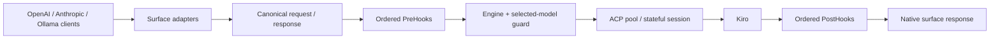
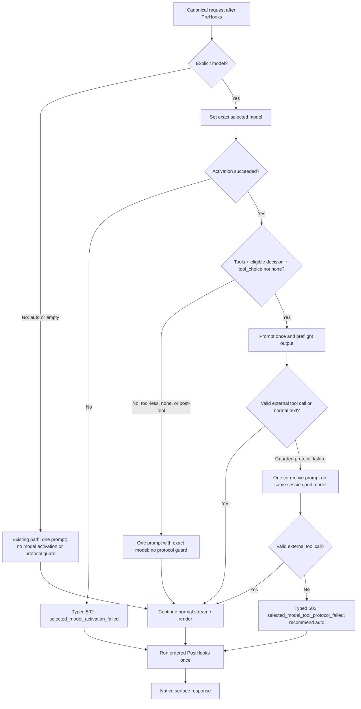

# Why the New OTTO Gateway Is the Preferred Foundation

**Evidence frozen 2026-08-13**

- Legacy `loop_24` revision: `fc3bf26d64e05cc3703ee39e323bbf3c1eaa4cd6`
- New `otto-gateway` revision: `ab63248ab1d7a9304fc8cf8862eb978ace7f7535`
- Legacy evidence file: `acp_server/acp-server-ollama.js` at the revision above
- Decision scope: Gateway architecture, client compatibility, model/tool behavior,
  lifecycle safety, privacy, operations, tests, and packaging. Performance numbers
  are outside this decision because no checked-in legacy/new benchmark comparison
  was found.

## Executive summary

The Go Gateway is the preferred foundation because it places the three supported
client protocols behind one typed canonical request/response model, one ordered
hook lifecycle, and one engine/ACP boundary. Selected-model tool recovery is
therefore implemented once and rendered back into each client's native wire
contract, instead of being a surface-specific prompt workaround. The proving
boundaries are the [canonical model](../../internal/canonical/chat.go),
[engine](../../internal/engine/engine.go), and the
[OpenAI](../../internal/adapter/openai/),
[Anthropic](../../internal/adapter/anthropic/), and
[Ollama](../../internal/adapter/ollama/) adapters.

The legacy Node gateway deserves explicit credit. At the frozen revision it
already preferred `reject_always`, counted denials and cancelled retry loops,
sent the permission response before cancellation, made one same-session
Anthropic correction, and narrowly exempted registered skill-file reads. The Go
Gateway retains or generalizes the first four. It intentionally does not copy
the skill-read exemption because caller tools now follow the canonical external
tool protocol; that difference is detailed under “Legacy safeguards retained.”

This preference is about verified behavior and maintainable boundaries, not a
claim of speed. The Go code proves bounded acquisition, buffers and parsers;
cooperative backpressure and cancellation; worker reuse; cardinality controls;
and exactly-once hook paths. Requests/second, latency, CPU, memory, cold starts,
and comparative throughput still require measurement.

## What changed architecturally

The legacy implementation combines HTTP surfaces, ACP framing, pooling,
sessions, prompt construction, tool parsing, skills, compression, and
observability in `acp_server/acp-server-ollama.js`. That file also contains
working safety mechanisms; the distinction is deployment shape, not an absence
of engineering discipline.

The Go implementation divides those responsibilities across typed packages. A
surface adapter decodes native input into [canonical.ChatRequest](../../internal/canonical/chat.go),
the [engine](../../internal/engine/engine.go) runs ordered hooks and ACP work,
[build_acp.go](../../internal/engine/build_acp.go) is the canonical-to-ACP prompt
builder, and the originating adapter renders native output. Pool and stateful
session ownership are separate in [pool](../../internal/pool/pool.go) and
[session](../../internal/session/entry_acp.go). This narrow waist makes a change
to model/tool policy apply to all surfaces while leaving wire compatibility in
the adapters.

The selected-model recovery work is defined by the approved
[design](../superpowers/specs/2026-08-13-explicit-model-tool-protocol-recovery-design.md)
and [implementation plan](../superpowers/plans/2026-08-13-explicit-model-tool-protocol-recovery.md).
The guard is deliberately narrower than the whole request pipeline: it applies
only when a request names an explicit model, supplies caller tools, and is at a
tool-decision boundary.

## Component architecture



The component arrows identify ownership, not a second serialization pass. The
[adapters](../../internal/adapter/) own HTTP decode/render, the
[canonical package](../../internal/canonical/) owns the shared semantic model,
the [plugin chain](../../internal/plugin/chain.go) owns explicit ordering, and
the [ACP client](../../internal/acp/client.go) owns Kiro protocol exchange. The
engine's aggregate and streaming collectors preserve those boundaries in
[collect.go](../../internal/engine/collect.go).

## Request lifecycle and hook ordering

The default PreHook order wired by [main.go](../../cmd/otto-gateway/main.go) is
Request ID, authentication, JSON-format steering, compression, PII processing,
and bounded logging. When chat trace is enabled it is prepended so privacy policy
can decide whether raw input is eligible for capture; the PostHook order is PII,
logging, then chat trace when enabled. [Chain.Filter](../../internal/plugin/chain.go)
retains registration order and rejects unknown configured hook names.

The engine runs PreHooks before session/model work. A short-circuit response
still passes through PostHooks. Normal aggregation, streaming completion,
selected-model recovery, and error cleanup converge on one PostHook pass; this
is pinned in [engine collector tests](../../internal/engine/collect_test.go) and
surface-specific [OpenAI](../../internal/adapter/openai/sse_posthook_test.go),
[Anthropic](../../internal/adapter/anthropic/sse_posthook_test.go), and
[Ollama](../../internal/adapter/ollama/ndjson_posthook_test.go) tests.



Eligibility and closed failure reasons live in
[tool_protocol.go](../../internal/engine/tool_protocol.go). The implementation
does not switch models during recovery: [engine.go](../../internal/engine/engine.go)
retains the same session and selected model for exactly one correction. Auto
and empty model requests skip activation and the guard. Every explicit request
first activates its exact model; after successful activation, explicit
tool-less, tool-result continuation, and `tool_choice: none` requests keep their
existing unguarded prompt path.

## Client compatibility: OpenAI, Anthropic, and Ollama

- OpenAI exposes `/v1/chat/completions`, `/v1/completions`, `/v1/models`, and
  `/v1/model-capabilities`; chat supports JSON and SSE, while the legacy
  completions shim is JSON-only. See [route registration](../../internal/adapter/openai/adapter.go)
  and [integration tests](../../internal/adapter/openai/integration_test.go).

- Anthropic exposes `/v1/messages` with Anthropic request decoding, message
  blocks, `tool_use`, stop reasons, JSON errors, and SSE event ordering. See the
  [adapter](../../internal/adapter/anthropic/adapter.go),
  [renderer](../../internal/adapter/anthropic/render.go), and
  [SSE tests](../../internal/adapter/anthropic/sse_test.go).

- Ollama exposes `/api/chat`, `/api/generate`, `/api/tags`, `/api/show`,
  `/api/ps`, and compatibility stubs. Chat/generate support JSON or NDJSON under
  their endpoint contracts. See [route registration](../../internal/adapter/ollama/adapter.go),
  [wire conversion](../../internal/adapter/ollama/wire.go), and
  [NDJSON tests](../../internal/adapter/ollama/ndjson_test.go).

All three adapters translate through the same canonical request. The native
response shape remains adapter-owned: OpenAI emits `tool_calls`, Anthropic emits
`tool_use`, and Ollama emits `message.tool_calls`. Cross-surface behavior is
tested rather than inferred from a single renderer.

## Tool-call handling

[build_acp.go](../../internal/engine/build_acp.go) serializes system and user
content, caller tool declarations, prior assistant tool calls, and later tool
results into one ACP prompt contract. This covers multi-turn tool execution:
the Gateway describes and returns tool calls, while the caller executes the
tool and submits its result on the next request.

On output, [collect.go](../../internal/engine/collect.go) first preserves native
ACP tool calls. [coerce.go](../../internal/engine/coerce.go) recognizes explicit
wrappers, fenced/prose variants, multiple wrappers, direct declarations, and an
exact deferred nested `tool_call` dispatcher. Configured aliases and safe name
overlap recovery are resolved by
[toolcall_resolve.go](../../internal/engine/toolcall_resolve.go). Unknown or
ambiguous text fails open as assistant text rather than being converted into an
invented call; exact and property tests cover these decisions in
[coerce_test.go](../../internal/engine/coerce_test.go) and
[build_acp_property_test.go](../../internal/engine/build_acp_property_test.go).

The parser is bounded: it scans at most 1 MiB, considers at most 32 candidates,
limits structural depth to 64, and caps truncation repair at 64 KiB. These are
code constants in [coerce.go](../../internal/engine/coerce.go), not workload
measurements.

## Selected-model behavior and graceful failure

`model: auto` means do not call ACP `session/set_model`. An explicit model means
activate that exact model before prompting. Activation failure is no longer
logged and ignored: the engine returns a closed
[SelectedModelError](../../internal/canonical/selected_model_error.go) with code
`selected_model_activation_failed`, and the adapter returns HTTP 502 without
prompting another model.

For eligible selected-model tool requests, the preflight classifier delays only
the bounded prefix needed to decide whether the response is a valid call, normal
text, or a conservative protocol failure. A failure such as a missing required
call, named-tool mismatch, malformed known wrapper, capability refusal, or
built-in-tool denial receives one corrective prompt on the same session and
model. A second failure becomes `selected_model_tool_protocol_failed` and the
safe message recommends `model: auto`; raw model output and internal causes are
not exposed. See [policy](../../internal/engine/tool_protocol.go),
[preflight](../../internal/engine/preflight.go), and
[recovery tests](../../internal/engine/tool_protocol_recovery_test.go).

Adapters preserve native error contracts. OpenAI carries the stable code in
`error.code`; Anthropic and Ollama carry it in `X-Otto-Error-Code`, with their
native JSON envelopes. Each surface tests ordinary streaming pre-header errors
and recovered streaming calls in [OpenAI integration tests](../../internal/adapter/openai/integration_test.go),
[Anthropic integration tests](../../internal/adapter/anthropic/integration_test.go),
and [Ollama integration tests](../../internal/adapter/ollama/integration_test.go).

## Reliability and lifecycle controls

The [pool](../../internal/pool/pool.go) keeps a configured set of ACP workers
warm and bounds acquisition with a default 30-second timeout; exhaustion maps
to a retryable 503 contract. A slot stays owned across the initial and recovery
prompt, so another request cannot interleave with the correction. Result,
cancel, and context-completion paths use exactly-once release coordination.
Scheduled max-turn and idle-memory recycling admits at most one replacement at a
time, and [pool tests](../../internal/pool/pool_test.go) plus
[recycling tests](../../internal/pool/worker_recycle_test.go) exercise those
lifecycles.

The [ACP stream](../../internal/acp/stream.go) uses a bounded channel and
cooperative, context-aware sends: slow consumers apply backpressure rather than
causing silent chunk drops. [Preflight](../../internal/engine/preflight.go) has a
single-slot downstream buffer, caps retained data at 1 MiB or 4,096 chunks, and
bypasses classification by replaying the preserved prefix plus live stream when
either cap is reached. Idle-timeout and watchdog cancellation are implemented
in [idle.go](../../internal/engine/idle.go) and
[engine.go](../../internal/engine/engine.go).

Stateful sessions have TTL reaping, hard maximum admission, per-session
serialization, and active-request protection in
[registry.go](../../internal/session/registry.go). Pool shutdown closes
admission, joins probes/recyclers, cancels active sessions, and then closes
clients; registry shutdown similarly cancels and closes entries. Tests cover
shutdown and race-sensitive paths in [pool tests](../../internal/pool/) and
[session tests](../../internal/session/).

## Privacy, PII, compression, logging, and tracing

The privacy service and PII hook transform inbound content and restore or check
outbound content under the configured policy. Strict-mode failures block rather
than silently forwarding content; lifecycle and boundary behavior are covered
in [privacy service](../../internal/privacy/service.go),
[PII hook](../../internal/plugin/pii/pii.go), and
[strict inbound](../../internal/privacy/service_strict_inbound_test.go) and
[outbound](../../internal/privacy/service_strict_outbound_test.go) tests.

Compression is a best-effort PreHook with panic/error containment and bounded
metrics in [compress/hook.go](../../internal/plugin/compress/hook.go). It runs
before PII in the configured default chain so its mutations are classified and
verified before provider dispatch. [LoggingHook](../../internal/plugin/logging.go)
records bounded metadata such as request ID, model, message count, and redaction
counts rather than request/response bodies.

[ChatTraceHook](../../internal/plugin/trace.go) writes raw standard-mode content
only when privacy context permits it; strict or unsafe paths receive a bounded
summary. Trace files use rotation, compression, and restrictive file mode.
Hook order and live posture are exposed through the configured chain and
`/health/hooks`, so this behavior is inspectable rather than implicit.

## Observability, configuration, and operations

The server exposes `/health`, `/health/pool`, `/health/hooks`, and
`/health/agents`; `/metrics` is opt-in and IP-allowlisted because it reveals
usage shape. Route and access policy are in [server.go](../../internal/server/server.go).
Request IDs are stamped before engine dispatch by
[request_id.go](../../internal/plugin/request_id.go) and preserved on native
errors by adapter tests.

[metrics.go](../../internal/metrics/metrics.go) uses route patterns rather than
raw paths, sanitizes and caps skill/client/model/MCP labels at 64 distinct values
per limiter, and accepts only closed selected-model reason/outcome values. It
tracks acquisition outcomes, pool/session state, privacy activity, model
requests, protocol failures, and recovery outcomes without accepting arbitrary
reason labels.

[config.go](../../internal/config/config.go) parses and validates pool, session,
timeouts, auth, hooks, privacy, compression, tracing, surface paths, tool aliases,
and denial limits. Focused coverage in [internal/config](../../internal/config/)
pins invalid values and cross-field constraints. Operational scripts expose
start/status/health and support collection for POSIX and PowerShell environments
through [scripts/gw](../../scripts/gw) and [scripts/gw.ps1](../../scripts/gw.ps1).

## Testing and cross-platform posture

The checked-in suites exercise canonical conversion, ACP framing and
permissions, preflight bounds, recovery, streaming wire shapes, hook ordering,
pool/session races, privacy modes, metrics cardinality, and configuration. The
commands in the final section reproduce the core and race suites. Exact
selected-model recovery is covered at engine level and through normal streaming
paths for all three adapters.

One targeted regression gap remains: Anthropic and Ollama map selected-model
errors returned from their post-PreHook collector reroute branches, but their
reroute tests currently exercise PII-induced collection without injecting a
selected-model error. OpenAI has that targeted case in
[handlers_reroute_test.go](../../internal/adapter/openai/handlers_reroute_test.go);
the corresponding [Anthropic](../../internal/adapter/anthropic/handlers_reroute_test.go)
and [Ollama](../../internal/adapter/ollama/handlers_reroute_test.go) files do not.
Their ordinary pre-header error and normal recovery contracts remain directly
tested by the integration suites linked above.

Build tags separate Unix process-group handling from Windows process handling in
[pool_pgid_unix.go](../../internal/acp/pool_pgid_unix.go) and
[pool_pgid_windows.go](../../internal/acp/pool_pgid_windows.go). The
[Makefile](../../Makefile) cross-compiles and packages Gateway archives for
Darwin arm64/amd64, Linux amd64, and Windows amd64; tray builds are Darwin and
Windows only. The matching [POSIX installer](../../scripts/install.sh),
[PowerShell installer](../../scripts/install.ps1), and
[publisher](../../scripts/publish.sh) encode the same supported targets.

## Legacy safeguards retained

The following legacy evidence comes from immutable revision
`fc3bf26d64e05cc3703ee39e323bbf3c1eaa4cd6`, file
`acp_server/acp-server-ollama.js`. Line references are for that exact blob and
can be reproduced by the `git show` command in the final section.

| Legacy safeguard | Classification in Go Gateway | Evidence and rationale |
|---|---|---|
| Prefer `reject_always` for Kiro built-ins | **Retained** | Legacy lines 457–465 choose the persistent rejection first. Go [pickRejectOption](../../internal/acp/translate.go) uses the same priority, with tests in [permission_test.go](../../internal/acp/permission_test.go). |
| Per-turn denial counter and bounded breaker | **Retained and generalized** | Legacy lines 190–193 and 463–471 default to four and cancel at the limit. Go [client.go](../../internal/acp/client.go) applies configurable per-turn counting, tested in [permission_handler_test.go](../../internal/acp/permission_handler_test.go). Denials are also visible to the surface-independent protocol classifier. |
| Same-session Anthropic nudge after a denial | **Generalized** | Legacy lines 2655–2664 define the nudge; lines 2797–2804 and 2851–2856 retry once only in Anthropic handlers. Go [engine.go](../../internal/engine/engine.go) performs one same-session, same-model correction for eligible OpenAI, Anthropic, and Ollama requests. |
| Permission response before cancellation | **Retained** | Legacy line 465 sends the JSON-RPC response before lines 469–471 cancel. Go [client.go](../../internal/acp/client.go) directly writes the response before invoking cancel, and [permission_handler_test.go](../../internal/acp/permission_handler_test.go) pins the ordering. |
| Narrow skill-file read exemption | **Intentionally not copied** | Legacy lines 439–454 allow only matched registered skill paths and do not count the read as a denial; lines 1460–1464 mirror the exemption in the prompt. Go denies Kiro built-ins during caller-tool turns and routes caller capabilities through canonical external tools. If direct Kiro skill-file reads return, they need a comparably narrow policy and dedicated test rather than a broad built-in-tool allowance. |

The legacy implementation also had warm workers, serialized stateful sessions,
TTL reaping, cancellation on prompt timeout, and tool wrapper parsing. The Go
design preserves those intents while making acquisition timeout, hard session
admission, parser/preflight bounds, stream backpressure, worker recycling, and
shutdown joins explicit in separately tested packages.

## Capability comparison matrix

| Area | Legacy Gateway | New Gateway | Why it matters | Evidence |
|---|---|---|---|---|
| Implementation structure and canonical narrow waist | One JavaScript service file owns surfaces and core behavior. | Typed surface, canonical, engine, ACP, pool, session, plugin, and metrics packages. | One semantic policy can serve three native wire contracts. | Legacy file; [canonical](../../internal/canonical/chat.go), [engine](../../internal/engine/engine.go) |
| OpenAI, Anthropic, and Ollama coverage | Ollama and Anthropic handlers are present; no OpenAI-compatible route is defined in the reviewed blob. | OpenAI, Anthropic, and Ollama adapters are registered. | Existing clients retain native contracts while sharing behavior. | Legacy file route definitions; [adapters](../../internal/adapter/) |
| Streaming/non-streaming parity | Ollama and Anthropic implement both modes, with surface-owned logic. | All three chat surfaces test native streaming and non-streaming shapes. | Tool behavior is available without forcing a client wire-mode change. | Legacy lines 2236–2425 and 2680–2870; [adapter tests](../../internal/adapter/) |
| Native calls, wrappers, deferred dispatcher, multi-turn results | Explicit wrapper prompt/parser and conversation/tool-result reconstruction are implemented. | Native calls are preferred; bounded wrapper coercion, exact deferred dispatcher, aliases, and canonical multi-turn results are shared. | Providers can use native calls while wrapper-only models remain interoperable. | Legacy lines 1419–1531 and 1653–1735; [coerce](../../internal/engine/coerce.go), [ACP builder](../../internal/engine/build_acp.go) |
| Selected model activation | `set_model` failures are logged and ignored; Anthropic model resolution may fall back to auto. | Exact activation failure stops before prompt with a typed 502. | A selected-model request cannot silently run under another model. | Legacy lines 609–614 and 2621–2643; [selected error](../../internal/canonical/selected_model_error.go), [engine](../../internal/engine/engine.go) |
| Denial recovery and recommend-auto failure | Anthropic alone nudges once on the same session after denial. | Eligible requests on every surface correct once on the same session/model, then return a safe typed failure recommending auto. | Failure is bounded and client-actionable. | Legacy lines 2655–2664, 2797–2804, 2851–2856; [recovery tests](../../internal/engine/tool_protocol_recovery_test.go) |
| Bounded denial circuit breaker | Per-turn, default four; response precedes cancellation. | Configurable per-turn breaker, response-before-cancel, denial surfaced to engine classification. | Built-in retries cannot consume the whole request deadline unnoticed. | Legacy lines 190–193 and 457–471; [ACP permission handler](../../internal/acp/client.go) |
| Pool capacity and acquisition | Fixed warm pool; waiters enter an unbounded queue with no acquire deadline. | Fixed warm pool with bounded acquisition and retryable exhaustion. | Capacity pressure terminates with a defined response. | Legacy lines 675–720; [pool config](../../internal/pool/config.go), [acquire tests](../../internal/pool/acquire_metrics_test.go) |
| Worker recycling | Dead workers are reinitialized; no max-turn/idle-memory schedule appears in the reviewed pool. | Max-turn and idle-memory recycling with one scheduled recycle in flight. | Long-lived worker replacement is policy-driven and observable. | Legacy lines 683–711; [recycling code](../../internal/pool/pool.go), [idle tests](../../internal/pool/idle_recycle_test.go) |
| Cancellation, idle timeout, backpressure, shutdown | Prompt timeout cancels; shutdown closes pool slots; stateful reaper skips busy entries. | Context cancellation, watchdog/idle timeout, bounded blocking streams, joined/idempotent shutdown. | Request termination and process ownership have explicit handoff rules. | Legacy lines 617–668, 711, 829–834; [ACP stream](../../internal/acp/stream.go), [pool](../../internal/pool/pool.go) |
| Bounded parsing and fail-open behavior | Wrapper parser is tolerant; no equivalent complete parser budget set was found in the reviewed blob. | Scan/candidate/depth/repair caps; unknown text remains text; preflight cap triggers bypass. | Malformed or large model output has bounded classification work. | Legacy parser lines 1653 onward; [coerce](../../internal/engine/coerce.go), [preflight](../../internal/engine/preflight.go) |
| Ordered privacy/PII/compression/logging/tracing hooks | Skills, compression, prompts, and logging are coordinated inside the service file. | Explicit allowlisted Pre/Post chain with privacy, compression, bounded logs, and privacy-aware trace. | Operators can inspect order and test each boundary independently. | Legacy file; [chain](../../internal/plugin/chain.go), [main wiring](../../cmd/otto-gateway/main.go) |
| Request IDs, health, metrics cardinality, errors | Health/stats routes and counters exist; errors/logging are surface-local. | Request IDs, detailed health, allowlisted metrics, capped labels, and native typed error contracts. | Operations and clients receive bounded, correlatable signals. | Legacy health/stats sections; [server](../../internal/server/server.go), [metrics](../../internal/metrics/metrics.go) |
| Config validation and test depth | Environment parsing and defaults live with implementation; no comparable unit suite is in the reviewed file. | Package-level validation with focused engine, ACP, pool, session, adapter, plugin, privacy, and metrics suites. | Invalid combinations fail at a defined boundary and regressions have local owners. | Legacy config section; [config tests](../../internal/config/), [internal tests](../../internal/) |
| Cross-platform packaging/release surfaces | The reviewed source is a Node entry point; packaging was not evaluated outside the frozen evidence file. | Gateway archives for Darwin arm64/amd64, Linux amd64, Windows amd64; installers for POSIX and Windows; tray for Darwin/Windows. | Supported artifacts and installers are reproducible from repository targets. | [Makefile](../../Makefile), [installers](../../scripts/), [publisher](../../scripts/publish.sh) |

## Performance: proved properties versus measurements

| Category | Status at the frozen revisions |
|---|---|
| **Proved by architecture/tests** | Bounded ACP/preflight buffers; bounded parser work; warm-worker reuse; cooperative stream backpressure; bounded pool acquisition; request cancellation and idle timeout; bounded metrics cardinality; no duplicate PostHook pass on tested normal, reroute, and recovery paths. Evidence: [stream](../../internal/acp/stream.go), [preflight](../../internal/engine/preflight.go), [pool](../../internal/pool/pool.go), [metrics](../../internal/metrics/metrics.go), and [collector tests](../../internal/engine/collect_test.go). |
| **Requires measurement** | Requests/second; p50/p95 latency; memory reduction; CPU reduction; cold-start improvement; comparative throughput. No checked-in legacy/new benchmark result supports a numerical or directional comparison. |

Warm pooling is designed to avoid starting a Kiro process for every request; it
does not by itself prove a latency or throughput result. A credible comparison
needs identical hardware, Kiro/model versions, request corpus, concurrency,
warm-up, streaming definitions, and percentile/reporting rules, with raw output
checked into the repository.

## Migration and model-selection guidance

1. Point an existing OpenAI, Anthropic, or Ollama client at the corresponding
   Gateway base path and keep its native request/response types. Confirm endpoint
   differences in the adapter route files linked above.
2. Start with `model: auto` when availability is more important than pinning a
   model. Auto bypasses `set_model` and the selected-model protocol guard.
3. Use an explicit model only when the workflow requires that identity. Obtain a
   valid identifier from the applicable model-discovery endpoint, then treat
   `selected_model_activation_failed` as an invalid/unavailable selection.
4. For caller-executed tools, preserve the assistant call ID/name and return the
   result in the next request's native tool-result shape. The Gateway does not
   execute the caller's function.
5. On `selected_model_tool_protocol_failed`, either retry with `model: auto` as
   recommended by the safe error or choose another explicitly verified model.
   Do not blindly retry the same selected request; the Gateway already used its
   single corrective attempt.
6. Before rollout, inspect `/health`, `/health/pool`, `/health/hooks`, and the
   allowlisted `/metrics`; run the test commands below on the deployment commit.

## Known limits and future work

- No checked-in benchmark compares the frozen legacy and Go revisions. The
  performance quantities listed above remain unmeasured.
- Preflight intentionally bypasses correction after 1 MiB or 4,096 chunks and
  replays the preserved stream; this bounds buffering but cannot guarantee a
  correction for oversized preambles.
- The guard does not auto-switch models. Exact selection either succeeds on that
  model or returns a typed failure.
- Caller tools, including MCP-backed tools, are described and surfaced by the
  Gateway but executed by the caller. Direct Kiro skill reads do not inherit the
  legacy exemption.
- Add targeted Anthropic and Ollama tests that inject selected-model errors into
  the post-PreHook collector reroute branches. Current direct tests cover the
  reroute and selected-model streaming contracts separately, not their exact
  intersection.
- OpenAI `/v1/completions` is a JSON compatibility shim; clients requiring
  streamed legacy completions should use chat completions or validate their
  downgrade expectations in [completions tests](../../internal/adapter/openai/completions_test.go).

## Evidence and reproduction commands

The minimum reviewed Go evidence set is:

| Concern | Frozen-revision evidence |
|---|---|
| Canonical request/response | [internal/canonical/chat.go](../../internal/canonical/chat.go) |
| Engine, collection, coercion, preflight | [engine.go](../../internal/engine/engine.go), [collect.go](../../internal/engine/collect.go), [coerce.go](../../internal/engine/coerce.go), [preflight.go](../../internal/engine/preflight.go) |
| ACP client, stream, permission policy | [client.go](../../internal/acp/client.go), [stream.go](../../internal/acp/stream.go), [translate.go](../../internal/acp/translate.go). The brief's proposed `internal/acp/permission.go` does not exist at this revision; its responsibilities are in these files. |
| Pool and stateful sessions | [pool.go](../../internal/pool/pool.go), [entry_acp.go](../../internal/session/entry_acp.go), [registry.go](../../internal/session/registry.go) |
| Client surfaces | [OpenAI](../../internal/adapter/openai/), [Anthropic](../../internal/adapter/anthropic/), [Ollama](../../internal/adapter/ollama/) |
| Hooks and privacy | [chain.go](../../internal/plugin/chain.go), [PII](../../internal/plugin/pii/pii.go), [compression](../../internal/plugin/compress/hook.go), [logging](../../internal/plugin/logging.go), [trace](../../internal/plugin/trace.go), [privacy service](../../internal/privacy/service.go) |
| Metrics and configuration | [metrics.go](../../internal/metrics/metrics.go), [internal/config](../../internal/config/) |
| Tests | Package-local `*_test.go` files under [internal](../../internal/) and the focused links throughout this document |

Reproduce the legacy evidence from the supplied local checkout without using its
working-tree copy:

```bash
LEGACY_CHECKOUT=/Users/coreyellis/code/gitlab.rosetta.ericssondevops.com/loop_24
LEGACY_REV=fc3bf26d64e05cc3703ee39e323bbf3c1eaa4cd6
git -C "$LEGACY_CHECKOUT" cat-file -t "$LEGACY_REV"
git -C "$LEGACY_CHECKOUT" show "$LEGACY_REV:acp_server/acp-server-ollama.js"
```

Run the core Go verification from the repository root:

```bash
go test ./internal/engine ./internal/acp ./internal/pool ./internal/session -count=1
go test ./internal/adapter/openai ./internal/adapter/anthropic ./internal/adapter/ollama -count=1
go test ./internal/plugin/... ./internal/privacy ./internal/metrics -count=1
go test -race ./internal/engine ./internal/acp ./internal/pool ./internal/session -count=1
go vet ./...
```

The following is the exact sanitized Hermes deferred-dispatcher request shape:
Hermes offers one outer function named `tool_call`; that function carries the
deferred inner tool's `name` and `arguments`. The inner name
`synthetic_list_group_projects`, group `example-engineering`, and limit values
below replace the private connector, group, and arguments from the original
reproduction. The outer schema and request structure match the proven
[OpenAI nested-dispatcher integration](../../internal/adapter/openai/integration_test.go).
Substitute an explicit identifier returned by the Gateway's `/v1/models`; add
your normal local authorization header only if your Gateway enables
authentication. No credential or private connector data appears here.

```bash
GATEWAY_URL=http://127.0.0.1:18080
SELECTED_MODEL=replace-with-id-from-v1-models

curl --fail-with-body --silent --show-error \
  -H 'Content-Type: application/json' \
  --data @- "$GATEWAY_URL/v1/chat/completions" <<JSON
{"model":"$SELECTED_MODEL","messages":[{"role":"user","content":"Use the deferred tool named synthetic_list_group_projects with arguments group example-engineering, recursive true, max_groups 2, and max_projects 3."}],"stream":false,"tools":[{"type":"function","function":{"name":"tool_call","parameters":{"type":"object","properties":{"name":{"type":"string"},"arguments":{"type":"object"}},"required":["name","arguments"]}}}]}
JSON
```

A successful response contains an OpenAI `tool_calls` entry whose function name
is `tool_call`. Its JSON-string `function.arguments` decodes to this synthetic
deferred call:

```json
{"name":"synthetic_list_group_projects","arguments":{"group":"example-engineering","recursive":true,"max_groups":2,"max_projects":3}}
```

If exact activation fails, expect HTTP 502 and
`error.code=selected_model_activation_failed`. If both tool-protocol attempts
fail, expect HTTP 502 and
`error.code=selected_model_tool_protocol_failed`; the safe message recommends
`model: auto` and excludes raw model output/internal causes.

Use this control to exercise the unchanged auto path with the same sanitized
Hermes message, outer dispatcher schema, and synthetic inner values:

```bash
curl --fail-with-body --silent --show-error \
  -H 'Content-Type: application/json' \
  --data @- "$GATEWAY_URL/v1/chat/completions" <<'JSON'
{"model":"auto","messages":[{"role":"user","content":"Use the deferred tool named synthetic_list_group_projects with arguments group example-engineering, recursive true, max_groups 2, and max_projects 3."}],"stream":false,"tools":[{"type":"function","function":{"name":"tool_call","parameters":{"type":"object","properties":{"name":{"type":"string"},"arguments":{"type":"object"}},"required":["name","arguments"]}}}]}
JSON
```

For Anthropic or Ollama clients, the same two error codes are returned in
`X-Otto-Error-Code` with a surface-native JSON error body. These commands
exercise safe request and response examples; the policy proof comes from the
[policy matrix](../../internal/engine/tool_protocol_test.go) and
[ineligible-path recovery tests](../../internal/engine/tool_protocol_recovery_test.go).
They are not performance benchmarks.
