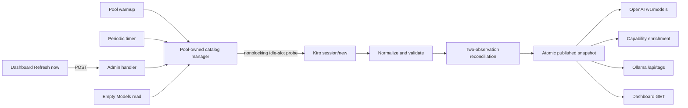
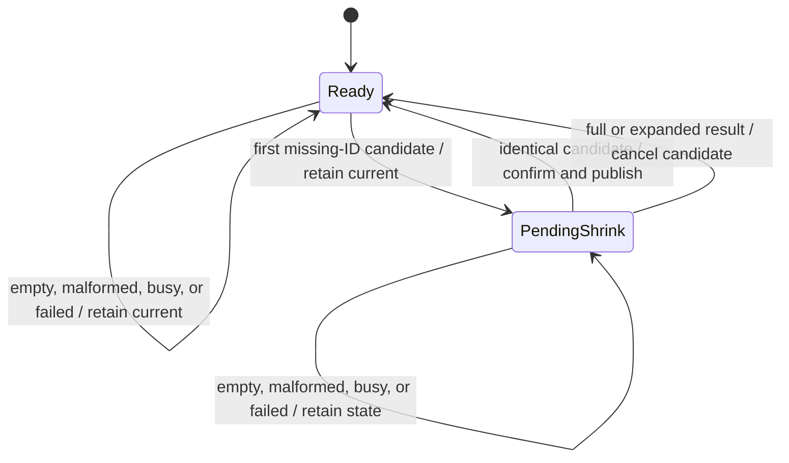

# Model catalog dashboard and live refresh — design

**Date:** 2026-08-13

**Status:** Approved in discussion; awaiting document review.

**Scope:** Make the Kiro model catalog visible on the main Gateway dashboard
and keep that catalog current without restarting the Gateway. The pool owns
discovery, periodic refresh, manual refresh, validation, and reconciliation.
All existing model-list consumers continue to read one shared catalog.

## Problem

The Gateway captures Kiro's `session/new` model catalog during pool warmup. It
retries an empty startup result and can lazily recover an empty catalog, but it
accepts any non-empty startup result as final for the lifetime of the process.
If Kiro temporarily reports a partial but non-empty catalog during startup,
models remain missing from `/v1/models`, `/v1/model-capabilities`, and
`/api/tags` until the Gateway restarts.

Operators currently cannot see catalog discovery state on the dashboard or
request a safe rediscovery. This makes a transient upstream discovery issue
look like a permanent compatibility or registry problem.

## Goals

- Display the live model catalog on the main dashboard in a polished grouped
  table.
- Refresh the catalog automatically every 15 minutes by default.
- Make the interval configurable and allow periodic refresh to be disabled.
- Provide a safe **Refresh now** dashboard action.
- Never delay, interrupt, or preempt client traffic to perform catalog work.
- Add newly discovered models promptly while protecting against transient
  partial catalogs.
- Keep OpenAI, capability, Ollama, and dashboard model views consistent.
- Preserve size-one pool safety, cancellation, shutdown, race, and
  exactly-once slot-return properties.
- Expose useful operational state without exposing upstream details.

## Non-goals

- No change to model selection, model aliases, tool protocol, or request
  routing.
- No capability probing or inference from model marketing names.
- No persistent catalog cache across Gateway restarts.
- No dashboard authentication redesign.
- No client-request fallback to another model.
- No new dependency, background worker process, or external data store.
- No claim that periodic discovery improves request latency or throughput;
  those performance effects are not measured by this work.

## Decisions

### D1 — The pool owns the catalog manager

The pool already owns Kiro workers, `session/new`, catalog capture, worker-turn
accounting, cancellation, recycling, and shutdown. It therefore owns a single
catalog manager that coordinates:

- warmup capture;
- the existing empty-catalog lazy self-heal;
- scheduled refresh;
- manual refresh;
- candidate validation and reconciliation;
- refresh status for operator surfaces.

The admin package is a presentation and control surface only. It must not
create ACP clients, borrow slots directly, or maintain a second catalog.

`Pool.Models()` remains the compatibility read seam used by the OpenAI and
Ollama adapters. It returns a defensive copy of the currently published
catalog. The capability combiner continues to enrich that same live snapshot
through the embedded registry. Consequently, `/v1/models`,
`/v1/model-capabilities`, `/api/tags`, Ollama model validation, and the
dashboard converge on one pool-owned source.

### D2 — Catalog state has a dedicated synchronization boundary

Catalog data and refresh metadata use a dedicated catalog mutex rather than
extending the pool's general `p.mu` critical sections. The synchronized state
contains:

- the published model slice;
- a monotonically increasing in-process generation;
- the pending-removal candidate and its normalized ID-set fingerprint;
- refresh-in-progress state;
- interval and next-scheduled time;
- last attempt, last successful probe, and last applied-update times;
- the last bounded outcome code;
- pending-removal count.

Readers copy a complete published slice under the catalog read lock and never
observe a partially replaced catalog. Network calls, ACP calls, pool-channel
operations, cancellation, recycling, logging, and JSON encoding never occur
while the catalog mutex is held.

The existing pool lifecycle ordering remains authoritative. Refresh goroutine
admission is ordered against `Pool.Close`, and shutdown waits for the scheduler
and any admitted probe. A refresh terminal path returns or recycles its slot
through the existing pool lifecycle exactly once.

### D3 — Every refresh is non-disruptive and single-flight

Scheduled, manual, and empty-catalog self-heal probes share one single-flight
gate. A probe:

1. checks shutdown and single-flight admission;
2. attempts a non-blocking receive from the free-slot channel;
3. if no slot is immediately available, exits without waiting;
4. marks the acquired slot checked out using the existing pool invariant;
5. creates one bounded throwaway `session/new` on that slot;
6. reads `AvailableModels`, counts the successful `session/new` as one worker
   turn, and cancels the throwaway session;
7. validates and reconciles the candidate outside pool and catalog locks; and
8. returns or recycles the slot exactly once.

The probe timeout remains bounded at 10 seconds. Request traffic has priority:
a scheduled refresh with no immediately idle slot records `skipped_busy` and
waits for the next interval. It does not queue behind or preempt a request. A
manual refresh reports the busy condition to the operator and likewise does
not wait for a slot.

A size-one pool follows the same rules. It refreshes only while its sole slot
is idle. Concurrent button clicks, a timer tick, an empty-catalog read, and
shutdown cannot create concurrent probes.

### D4 — Normalize and validate before reconciliation

A candidate is normalized before comparison:

- trim surrounding whitespace from IDs and names;
- reject empty or whitespace-only IDs;
- omit the synthetic `auto` entry because adapters and the capability registry
  already add it consistently;
- de-duplicate repeated IDs with first occurrence winning, matching the
  capability registry's defensive live-catalog behavior; and
- compare model membership by a deterministically sorted set of exact IDs.

The candidate must contain at least one explicit model. An empty candidate,
an ACP error, a timeout, cancellation, or malformed data never replaces the
last known-good catalog and never counts as removal confirmation. A name change
for an existing ID is metadata, not a removal.

The admin response exposes only bounded outcome codes. Raw ACP responses,
upstream error strings, environment values, paths, credentials, schemas, and
session details never reach the browser.

### D5 — Expansions apply immediately; removals require two observations

Reconciliation compares the normalized candidate with the currently published
ID set.

- **Equal membership:** publish changed names immediately; otherwise record
  `unchanged`. Clear any incompatible pending-removal candidate.
- **Pure expansion:** publish the candidate immediately and clear pending
  removal state.
- **Shrink:** keep the current published catalog and stage the exact candidate
  set as `pending_shrink`.
- **Mixed addition and removal:** publish the newly observed additions by
  merging them into the current catalog, but retain models missing from the
  candidate. Stage the exact candidate as `pending_shrink`.

The next valid non-empty probe confirms removal only if its normalized ID set
exactly matches the staged candidate's fingerprint. On that second identical
observation, publish the candidate and record `shrink_confirmed`. Any different
valid result cancels or replaces the pending candidate according to the same
rules; it cannot accidentally confirm a prior result.

This rule is deliberately based on two observations rather than elapsed wall
time. The 30-second manual cooldown prevents a rapid double-click from
immediately confirming a transient shrink. Scheduled observations naturally
occur on separate intervals.

### D6 — Refresh interval is explicit and validated

Add the environment setting:

```text
MODEL_CATALOG_REFRESH_INTERVAL_SEC=900
```

Semantics:

| Value | Behavior |
|---|---|
| unset | refresh every 900 seconds |
| `0` | disable scheduled refresh; warmup, lazy self-heal, and manual refresh remain available |
| `60`–`86400` | use the configured number of seconds |
| negative, non-numeric, or nonzero outside the range | fail startup with a clear configuration error |

The scheduler starts after successful pool warmup. It does not perform an
extra immediate probe; the first scheduled attempt is one configured interval
after warmup. A busy skip schedules the next ordinary interval rather than a
tight retry loop. There is no runtime interval mutation in this design; an
operator changes the environment and restarts to change scheduling policy.

The existing warmup retry schedule and empty-catalog on-read self-heal remain.
They are routed through the common catalog machinery where their lifecycles
overlap, so the new scheduler does not weaken cold-start recovery.

### D7 — Expose a dedicated, sanitized admin read model

Add a read interface supplied to the admin package by composition root wiring.
It returns the pool refresh snapshot and the existing canonical capability
catalog. The admin package maps those values to its own JSON response; it does
not import the pool implementation.

`GET /admin/api/model-catalog` returns a stable shape equivalent to:

```json
{
  "state": "ready",
  "count": 19,
  "generation": 3,
  "models": [
    {
      "id": "gpt-5.6-sol",
      "name": "GPT 5.6 Sol",
      "selection_mode": "explicit",
      "capabilities": {
        "completion": "supported",
        "tools": "unknown",
        "vision": "unknown",
        "reasoning": "unknown"
      }
    }
  ],
  "refresh": {
    "enabled": true,
    "interval_seconds": 900,
    "in_progress": false,
    "last_attempt_at": "2026-08-13T19:00:00Z",
    "last_success_at": "2026-08-13T19:00:01Z",
    "last_updated_at": "2026-08-13T19:00:01Z",
    "next_attempt_at": "2026-08-13T19:15:00Z",
    "last_outcome": "expanded",
    "pending_removals": 0
  }
}
```

Timestamps are RFC 3339 UTC strings and are omitted when no corresponding
event has occurred. `models` is always an array and includes exactly one
synthetic `auto` entry followed by the currently published explicit models;
`count` is the length of that displayed array. Capability values retain the
existing three-state contract: `supported`, `unsupported`, or `unknown`.
Evidence details are not needed by the dashboard and are omitted from this
endpoint.

Bounded catalog states are `ready`, `refreshing`, `pending_shrink`, `degraded`,
and `disabled`. Bounded outcome codes are `startup`, `unchanged`, `expanded`,
`metadata_updated`, `pending_shrink`, `shrink_confirmed`, `skipped_busy`,
`failed`, and `cancelled`. Unknown internal values map to `failed` rather than
creating an unbounded UI or telemetry label.

State precedence is deterministic: `refreshing`, then `pending_shrink`, then
`degraded` when no explicit catalog is published, then `disabled` when the
catalog is healthy but scheduling is off, otherwise `ready`. Disabling the
scheduler therefore cannot conceal a pending removal or degraded catalog.

### D8 — Manual refresh is a guarded POST

Add `POST /admin/api/model-catalog/refresh`. It has no request body and runs one
bounded synchronous probe so the button can report a definitive result.

Response behavior:

| Condition | HTTP | Safe code |
|---|---:|---|
| unchanged, expanded, metadata update, pending shrink, or confirmed shrink | 200 | corresponding bounded outcome |
| another probe is active | 409 | `catalog_refresh_in_progress` |
| manual cooldown remains | 429 | `catalog_refresh_cooldown` |
| no slot is immediately free | 503 | `catalog_refresh_busy` |
| upstream probe fails or times out | 502 | `catalog_refresh_failed` |
| Gateway is shutting down | 503 | `catalog_refresh_unavailable` |

Retryable responses include a bounded `Retry-After` value where applicable.
The manual-action cooldown is 30 seconds from the last admitted manual probe.
Scheduled refreshes and empty-catalog self-heal are not suppressed by the
manual cooldown, but the shared single-flight gate still prevents overlap.

The POST applies the dashboard's existing exposure and IP-allowlist model. In
addition, it rejects a browser request that explicitly identifies itself as
cross-origin using `Origin` or Fetch Metadata headers. This is defense in depth,
not a substitute for the deployment's existing dashboard access controls.
Direct operator clients without browser-origin headers remain usable.

Every error body contains only the safe code, a fixed operator message, and
optional retry timing. It contains no wrapped upstream error.

### D9 — The main dashboard uses a grouped table

Add a **Model Catalog** card to the main dashboard between Active Sessions and
the Privacy Boundary. Its header contains:

- current model count;
- a status badge;
- last successful refresh;
- next scheduled refresh or `Automatic refresh disabled`;
- the effective interval; and
- a visually prominent **Refresh now** button.

The card fetches its dedicated GET endpoint on page load and on the existing
30-second dashboard polling cadence. A completed manual refresh immediately
re-fetches the catalog rather than waiting for the next poll.

The display groups entries by exact, presentation-only ID prefixes:

1. **Automatic** — the synthetic `auto` entry, pinned first;
2. **Anthropic / Claude** — IDs beginning `claude-`;
3. **OpenAI / GPT** — IDs beginning `gpt-`;
4. **Qwen** — IDs beginning `qwen`;
5. **Other models** — the stable fallback for every unrecognized ID.

Grouping is not capability inference and never affects routing. Within a group,
rows sort case-insensitively by display name using numeric-aware comparison,
then by exact ID as a deterministic tie-breaker. The UI performs this
presentation sort without changing the pool's published wire order.

Each semantic table row shows display name, exact model ID, and compact badges
for completion, tools, vision, and reasoning. Supported, unsupported, and
unknown have distinct text labels and must not rely on color alone.

The button exposes `aria-busy`, is disabled during an active request or
cooldown, preserves visible keyboard focus, and changes its label to
`Refreshing…` during work. Results are announced through a polite live region.
The pending-shrink warning states how many models await confirmation without
listing models removed by an unconfirmed upstream result. Busy and failure
messages explain that the current catalog remains in use.

On narrow viewports, the metadata header wraps cleanly and the table uses a
bounded horizontal scroll container rather than clipping IDs or capability
labels. Existing dashboard typography, spacing, dark/light themes, button
language, and card treatment remain authoritative.

### D10 — About and Docs explain configuration

The About page describes that the model catalog is live, pool-owned, and
periodically refreshed, and links to the main dashboard section. The embedded
Docs page records:

- `MODEL_CATALOG_REFRESH_INTERVAL_SEC` default and validation range;
- `0` disable semantics;
- the two-refresh removal safeguard;
- the GET and POST admin endpoints; and
- the fact that refresh never queues behind client traffic.

The catalog table is not duplicated on About. The main dashboard is the single
operator view.

### D11 — Observability stays bounded and privacy-safe

Structured logs record refresh source (`warmup`, `lazy`, `scheduled`, or
`manual`), bounded outcome, prior count, candidate count, published count,
pending-removal count, and duration. Model IDs, display names, session IDs, and
raw upstream errors are not required for routine refresh events.

Internal failure logs may retain the normal wrapped diagnostic error at the
server boundary, but neither the admin JSON nor client model endpoints expose
it. No prompt, completion, tool arguments, schemas, credentials, environment
values, or raw ACP frames are part of catalog refresh telemetry.

This design proves bounded concurrency, bounded probe duration, and nonblocking
slot acquisition through code structure and tests. It makes no unmeasured claim
about scheduler overhead, latency improvement, or throughput impact.

## Data flow



## Reconciliation state machine



## Test strategy

Implementation follows a test-first sequence.

### Pool and catalog manager

- warmup retains current retry and degrade behavior;
- a partial non-empty startup catalog expands on a later refresh;
- a valid equal catalog is unchanged;
- name-only changes apply without removal confirmation;
- empty, malformed, duplicate, and synthetic-auto inputs normalize as defined;
- pure expansion publishes immediately;
- first shrink stages while preserving the published set;
- identical second shrink confirms;
- failed or empty probes do not confirm;
- a different candidate resets confirmation;
- mixed add/remove publishes additions while staging removals;
- scheduled busy skip does not wait;
- manual busy returns its typed result;
- timer, manual, and lazy probes are single-flight;
- size-one pool behavior is safe;
- successful probes increment worker turns;
- release/recycle occurs exactly once on success, error, cancellation, timeout,
  confirmation, and shutdown races;
- `Close` joins scheduler and probe goroutines; and
- focused `-race` coverage exercises refresh, cancellation, and close
  interleavings.

### Configuration and wiring

- unset defaults to 900;
- zero disables the scheduler only;
- 60 and 86400 are accepted boundaries;
- negative, non-numeric, 1–59, and values above 86400 fail clearly;
- the same pool is wired to every catalog consumer and the admin read/action
  seams; and
- degraded/no-pool construction remains nil-safe.

### Admin HTTP contract

- GET returns deterministic arrays, bounded enums, three-state capabilities,
  UTC timestamps, and no evidence or upstream detail;
- POST status/code mapping covers success, pending confirmation, in-progress,
  cooldown, busy, failure, and shutdown;
- cross-origin browser POSTs are rejected;
- cooldown and `Retry-After` are deterministic; and
- handler cancellation propagates without leaking a probe or slot.

### Dashboard behavior

- Automatic, Claude, GPT, Qwen, and fallback grouping;
- numeric-aware deterministic sorting;
- capability badges distinguish all three states in text;
- refresh progress, cooldown, busy, success, pending, and failure rendering;
- existing polling continues after a catalog-endpoint failure;
- semantic table, live region, button label, focus, and keyboard behavior; and
- responsive table/card rendering and existing theme compatibility.

### Cross-surface acceptance

After an accepted refresh, focused integration tests assert that
`/v1/models`, `/v1/model-capabilities`, `/api/tags`, and the dashboard expose
the same explicit ID set, with one synthetic `auto` entry on each applicable
surface. Existing OpenAI, Anthropic, Ollama, pool, admin, static checks, race
suites, build gates, formatting, and architecture lint remain required before
completion.

## Rollout and compatibility

The default enables a low-frequency 15-minute scheduler. Operators who require
startup-only discovery can set the interval to `0` while retaining manual and
empty-catalog recovery. No existing client request or response schema changes.
The two new endpoints live only under `/admin/api`.

If Kiro repeatedly returns a legitimately smaller catalog, the removal becomes
visible after two matching valid probes. If it returns a transient partial
catalog once, the current models remain published and the dashboard explains
the pending state. Restart always begins with fresh warmup discovery; runtime
state is intentionally not persisted.

## Approved design summary

The approved design uses a pool-owned refresh manager, a configurable default
interval of 15 minutes, nonblocking idle-slot probes, a manual dashboard
button, immediate additions, two-observation removal confirmation, a grouped
main-dashboard table, and one atomic catalog shared by every protocol surface.
